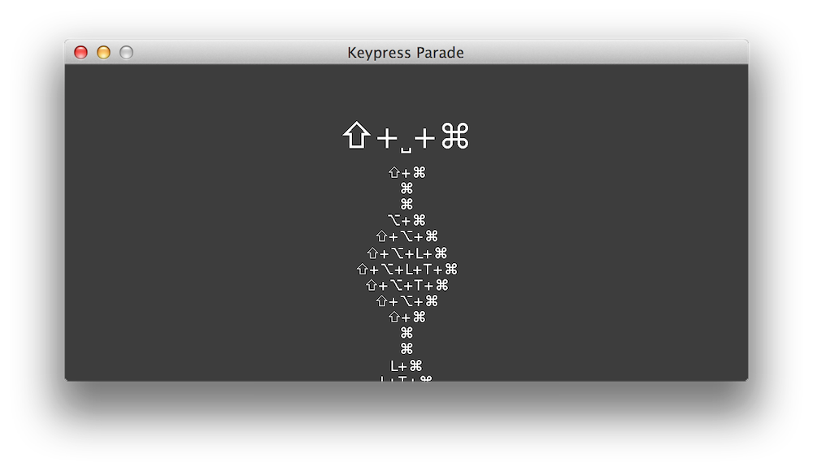

keypress-parade
===============



**Keypress Parade** is a simple Java app that displays current and previous keypresses.

### Installation

If you are on Windows, ensure that you have the [JDK](http://www.oracle.com/technetwork/java/javase/downloads/jdk8-downloads-2133151.html) installed.

From the `keypress-parade` directory on command line/terminal, enter the following to compile the code:

```$ javac -d . @compile.txt```

To run Keypress Parade after compiling, enter:

```$ java KeypressParade```